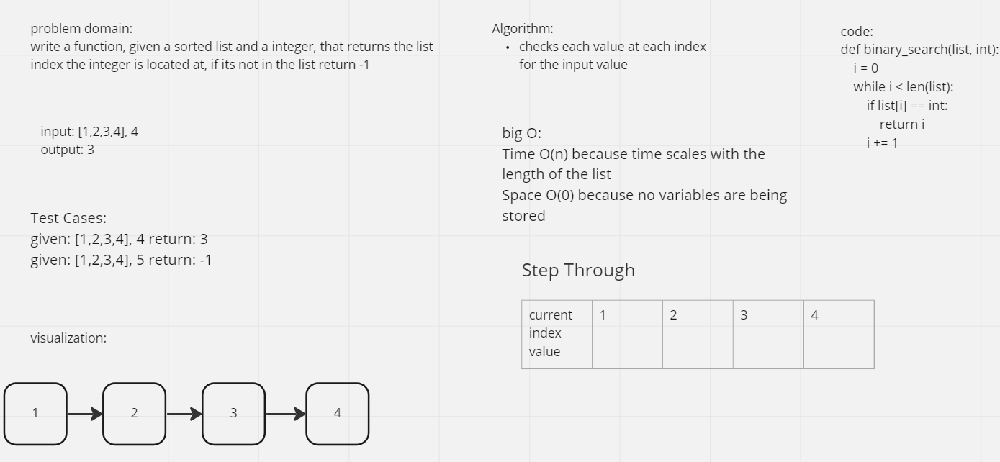

# Binary Search of Sorted Array
White board out a function called binary_search that takes a sorted list and a value, then returns the index of the list with which said value is located

## Whiteboard Process

## Approach & Efficiency
While not efficient I took the approach of checking individual values in the list
