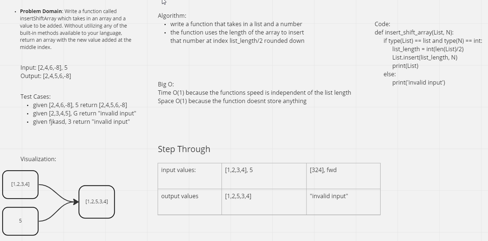

# Insert to Middle of a List
Writing a Function that takes in a list and a number, then inserts said number in the middle of said list

## Whiteboard Process

## Approach & Efficiency
First I wanted to know the length of the input list divide that by 2 then insert the input number finally returning the list with the new number

As far as Big O, I believe the timewise it is O(1) because the functions speed is independent of the size of its input, and for space wise I believe it is O(n) because the output is dependent on the size of the input array
