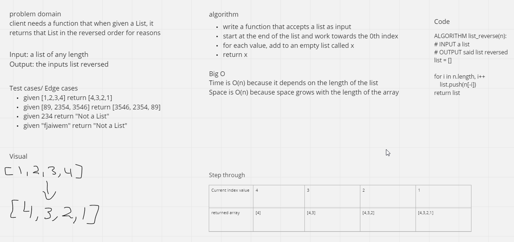

# Reverse a List
The whiteboard process of reversing a list in python

## Whiteboard Process

## Approach & Efficiency
I made the function take a list(x) then used a for loop to push each index of x into a new list in reversed order
