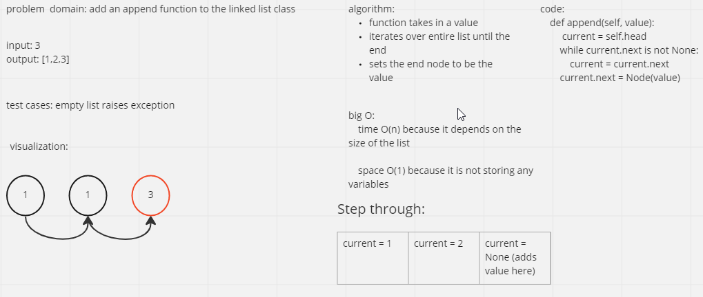

# Add Insertion functionality to a linked list
Added functions: append, insert_before, and insert_after to the linked list class

## Whiteboard Process

## Approach & Efficiency
All the functions added have a Big O time of O(n) because the loop through the list to either find the end or value that was passed in
