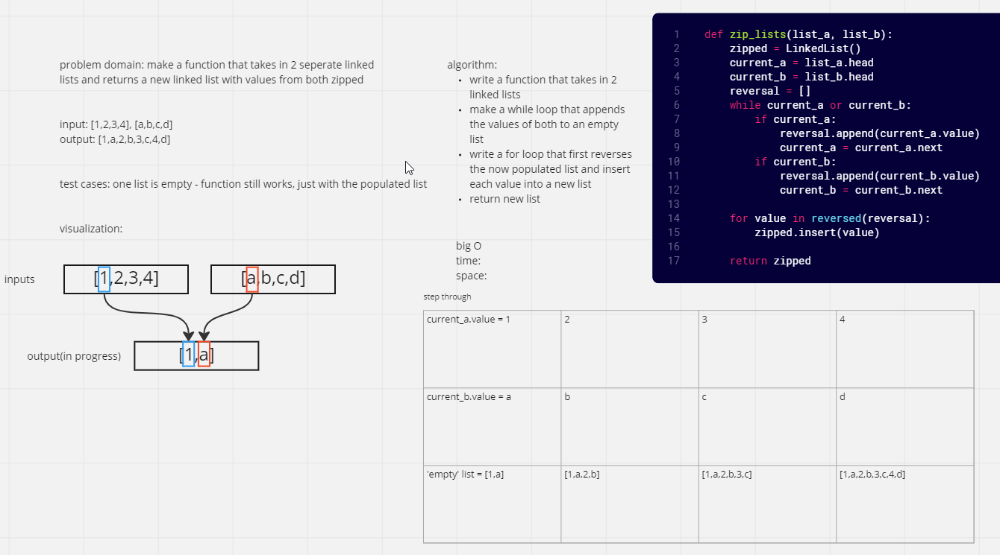

# Zip 2 linked list function
Added function: zip_list, that takes in 2 linked lists and returns zipped list

## Whiteboard Process

## Approach & Efficiency
The function added has a Big O time of O(2n) because there is a while loop: that gets the values of both lists and append it to an empty list then a for loop: that makes a new list and inserts the values from the populated list to the new linked list
