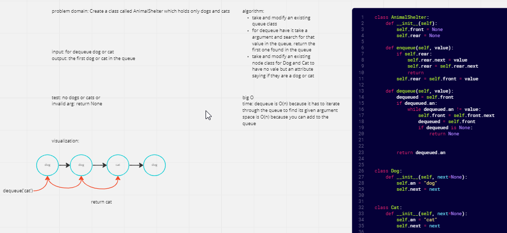

# Challenge Summary
Create a class called AnimalShelter which holds only dogs and cats.

## Whiteboard Process

## Approach & Efficiency
I added a modified node class to each of the Dog and Cat classes but each have their respective 'names' instead of values, then the animal shelter class was a slightly modified queue class that when using the dequeue method it searches for the animal wanted and returns that
