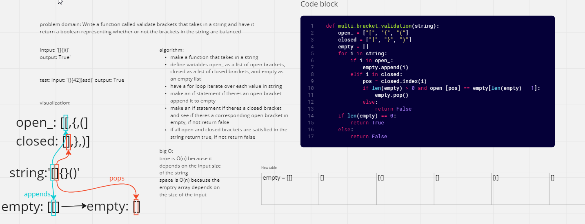

# Challenge Summary
Write a function called validate brackets
Arguments: string
Return: boolean (representing whether the brackets in the string are balanced)

## Whiteboard Process

## Approach & Efficiency
I used a list instead of a stack because it seemed faster, time and space are O(n) because both depend on the size of the input string
