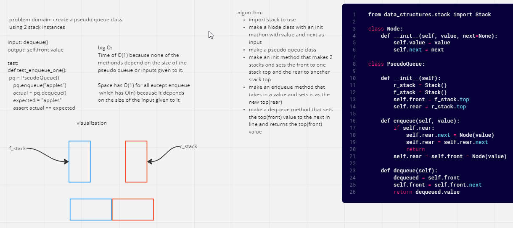

# Challenge Summary
Using 2 stack instances make a pseudo queue class

## Whiteboard Process

## Approach & Efficiency
What I did seemed way faster that the slinky approach describe in the next lecture
I visualized it as 2 stack put together on their side, All methods have a Time of O(1) because none of them depend on the size of the pseudo queue or inputs given to it. Space has O(1) for all except enqueue in queue which have O(n) because it depends on the size of the input given to it

