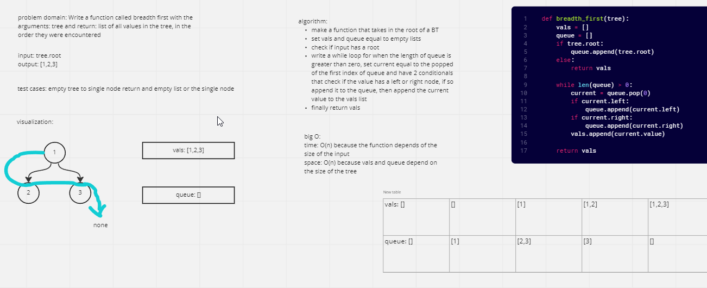

# Challenge Summary
Write a function called breadth first with the arguments: tree and return: list of all values in the tree, in the order they were encountered

## Whiteboard Process

## Approach & Efficiency
I tried using a queue class at first, but it was not working, so I opted to just use a list as a queue. Time is O(n) because the size of the list depends on the size of the tree the same with space
