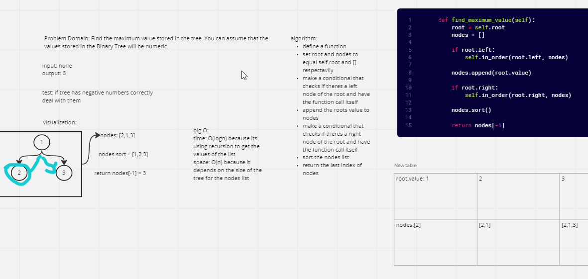

# Challenge Summary
Find the maximum value stored in the tree. You can assume that the values stored in the Binary Tree will be numeric.

## Whiteboard Process

## Approach & Efficiency
I used the in_order method to get a list then sorted it and returned the [-1] index
